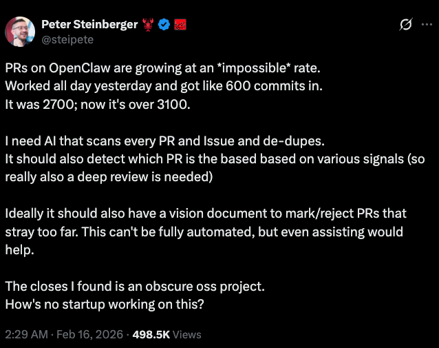

# PRism - AI Triage GitHub Action

AI-powered GitHub Action for smarter open-source triage. PRism detects duplicate issues and PRs, generates structured PR review summaries, applies intelligent labels, and optionally supports Postgres + pgvector for persistent similarity.

## Why This Exists

[](https://x.com/steipete/status/2023057089346580828)

PRism started as a response to high-volume OSS triage pain raised by [@steipete](https://github.com/steipete): duplicate issues, duplicate PRs, and too much manual review overhead.

## Features

- 🔍 **Duplicate Detection**: AI-powered duplicate detection for issues and PRs
- 📝 **Structured PR Reviews**: Comprehensive code reviews with categorized findings
- 🏷️ **Smart Labeling**: Automatic label suggestions and application
- 💾 **Stateful/Stateless**: Run in-memory or with Postgres + pgvector
- ⚡ **Fast**: Posts comments within 60 seconds
- 🔒 **Safe**: Never auto-closes or auto-merges

## Quick Start

```yaml
name: AI Triage
on:
  issues:
    types: [opened, edited]
  pull_request:
    types: [opened, edited, synchronize]

jobs:
  triage:
    runs-on: ubuntu-latest
    steps:
      - uses: danhdox/prism@v1
        with:
          github-token: ${{ secrets.GITHUB_TOKEN }}
          llm-api-key: ${{ secrets.OPENAI_API_KEY }}
```

## Roadmap

### Done (MVP)

- [x] Duplicate and related issue/PR detection with confidence signals
- [x] Structured PR review comments with findings + complexity estimate
- [x] Automatic label suggestions and application
- [x] Vision alignment analysis for PRs
- [x] Off-track handling modes: `comment`, `label`, `fail`
- [x] Stateful mode support with Postgres + pgvector

### Next

- [ ] Backlog triage mode for scheduled scans and prioritized queues
- [ ] Better explainability in comments (why this PR/issue was matched)
- [ ] Configurable confidence thresholds per repository workflow
- [ ] One-click "needs human review" escalation path

### Later

- [ ] Cross-repo similarity detection for org-wide triage
- [ ] Improved signal blending (semantic similarity + file/risk heuristics)
- [ ] Triage analytics dashboard and trend reporting

## Documentation

- 📖 [Full Documentation](./USAGE.md)
- 🚀 [Examples](./.github/workflows/ai-triage-example.yml)

## Requirements

- GitHub Actions workflow
- OpenAI API key (required)
- PostgreSQL with pgvector (optional, for stateful mode)

## License

MIT - see [LICENSE](./LICENSE)
